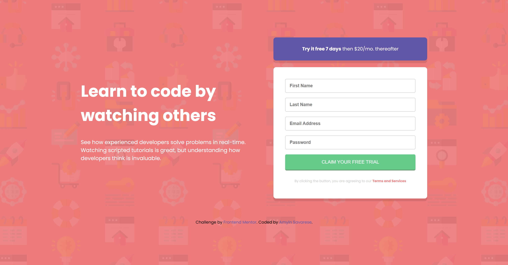

# Frontend Mentor - Intro component with sign up form solution

This is a solution to the [Intro component with sign up form challenge on Frontend Mentor](https://www.frontendmentor.io/challenges/intro-component-with-signup-form-5cf91bd49edda32581d28fd1). Frontend Mentor challenges help you improve your coding skills by building realistic projects. 

## Table of contents

- [Overview](#overview)
  - [The challenge](#the-challenge)
  - [Screenshot](#screenshot)
  - [Links](#links)
- [My process](#my-process)
  - [Built with](#built-with)
  - [What I learned](#what-i-learned)
  - [Code that I'm proud of](#code-that-im-proud-of)
  - [Continued development](#continued-development)
  - [Useful resources](#useful-resources)
- [Author](#author)


## Overview

### The challenge

Users should be able to:

- View the optimal layout for the site depending on their device's screen size
- See hover states for all interactive elements on the page
- Receive an error message when the `form` is submitted if:
  - Any `input` field is empty. The message for this error should say *"[Field Name] cannot be empty"*
  - The email address is not formatted correctly (i.e. a correct email address should have this structure: `name@host.tld`). The message for this error should say *"Looks like this is not an email"*

### Screenshot

### Desktop View


### Mobile View


### Links

- Solution URL: [Add solution URL here](https://your-solution-url.com)
- Live Site URL: [Add live site URL here](https://your-live-site-url.com)

## My process

### Built with

- Semantic HTML5 markup
- CSS custom properties
- JavaScript for the form setup
- Flexbox
- Desktop-first workflow

### What I learned

1. `addEventListener` Method:
- This method is used to attach an event handler to an element.
- Syntax: `element.addEventListener(eventType, eventHandler, useCapture);`
- `eventType`: A string that specifies the name of the event to listen for (e.g., 'click', 'submit').
- `eventHandler`: A function that will be called when the specified event is triggered.
- `useCapture` (optional): A boolean that indicates whether to use event capturing or bubbling (default is `false` for bubbling).

2. `'submit'` Event:
`'submit'`: This is the type of event to listen for. In this case, it specifies that the event listener is waiting for a "submit" event, which occurs when a form is submitted. It can be used to perform validation, prevent form submission, or handle form data.

3. Event Handler Function:
- `function(event) {...}`: This is the event handler function, also known as a callback function, that will be executed when the event occurs / is called when the 'submit' event is triggered.
- The `event` parameter inside the function provides access to the event object, which includes methods and properties related to the event (e.g., `event.preventDefault()` to stop the form from submitting).


### Code that I'm proud of:

```html
<!-- Adding "novalidate" to the form element disables the browser's built-in form validation.
This allows my custom JavaScript validation to handle all validation logic. -->
<form action="#" method="POST" class="styled-form" id="styledForm" novalidate>
  <input type="text" id="firstName" name="firstName" placeholder="First Name" required>
</form>
```
```css
.styled-form input[type="text"],
.styled-form input[type="email"],
.styled-form input[type="password"] {
    font-weight: 600;
    width: 100%;
    padding: 12px;
    margin-bottom: 15px;
    border: 1px solid var(--Gray);
    border-radius: 4px;
    box-sizing: border-box; /* This keeps the contact form in its box */
}

.styled-form input[type="text"]:focus,
.styled-form input[type="email"]:focus,
.styled-form input[type="password"]:focus {
    border: 1px solid var(--Blue); /* Change border color on focus */
    box-shadow: 0 0 5px var(--Blue); /* Add a blue shadow to indicate focus */
    outline: none; /* Remove default browser outline */
}

.styled-form button:hover {
    background-color: var(--DarkGreen);
}

.error-message {
    color: var(--Red);
    font-size: 15px;
    font-weight: 500;
    display: flex;
    justify-content: center;
    margin-top: 1rem;
}
```
```js
<script>
    // I need to attach an EVENT LISTENER to the form's submit event.
    document.getElementById('styledForm').addEventListener('submit', function(event) {
      // `event.preventDefault()` STOPS the form from being submitted, 
      // allowing the custom validation logic to run first.
        event.preventDefault();

        // I need to get input values and trim whitespace.
        const firstName = document.getElementById('firstName').value.trim();

        // I need to check each field individually. If a field is empty, 
        // set the `errorMessage.textContent` to the specific message for that field.
        const errorMessage = document.getElementById('errorMessage');
        // I need to clear the previous error message.
        errorMessage.textContent = '';

        // I need to VALIDATE each field individually and set specific error messages for each field.
        if (!firstName) {
            errorMessage.textContent = 'First Name cannot be empty';
            return;
        }

        // The email input should be checked against a pattern to ensure it follows the correct format.
        // The pattern /^[a-zA-Z0-9._-]+@[a-zA-Z0-9.-]+\.[a-zA-Z]{2,}$/ ensures the email format is correct.
        const emailPattern = /^[a-zA-Z0-9._-]+@[a-zA-Z0-9.-]+\.[a-zA-Z]{2,}$/;
        if (!emailPattern.test(email)) {
          // If it doesn't, a specific error message should be displayed.
            errorMessage.textContent = 'Looks like this is not an email';
            return;
        }
    });
  </script>
```

If you want more help with writing markdown, we'd recommend checking out [The Markdown Guide](https://www.markdownguide.org/) to learn more.


### Continued development

I want to focus more on JavaScript and work my way towards becoming for familiar and comfortable with setting up functions. I struggled with setting up the JS functionality for the form. I didn't know where to start, so I immediately asked ChatGPT for help again. The reasoning for everything certainly makes sense when ChatGPT explains it and breaks it down, I think I just need to keep familiarizing myself with functions in order for it to eventually become second nature to me. But I do feel like I am still struggling with remembering what functions to use and how they connect with things going on in the project.

I found the use of `focus` and `hover` to be interesting for the form. It definetely made the form more eye catching, and literally highlights what part of the form the user is on. I'd like to explore those types of CSS stylings in my future projects, because to me, it makes the webpage stand out more uniquely.

Sometimes I feel confused when styling in CSS with `html` vs `body` and when to apply certain styling to which, like `width` or `min-height`, for example.

### Useful resources

- [ChatGPT](https://www.example.com) - ChatGPT helped me with some CSS Styling that I didn't know how to do, and with JavaScript functions for the form section of the project. I like using ChatGPT as a resource because I am able to ask it to explain in further detail about something if I don't understand why certain code is used.

## Author

- Frontend Mentor - [@Amsav23](https://www.frontendmentor.io/profile/Amsav23)